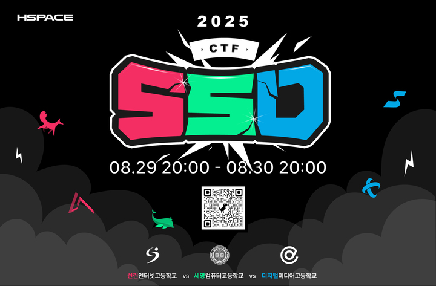
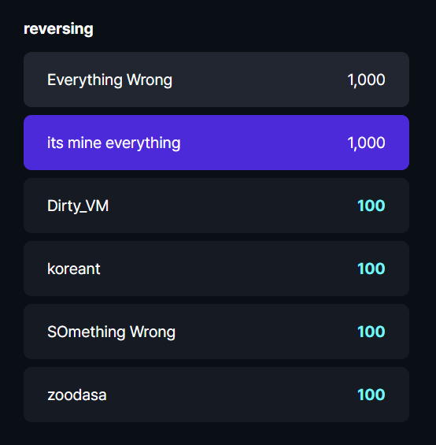
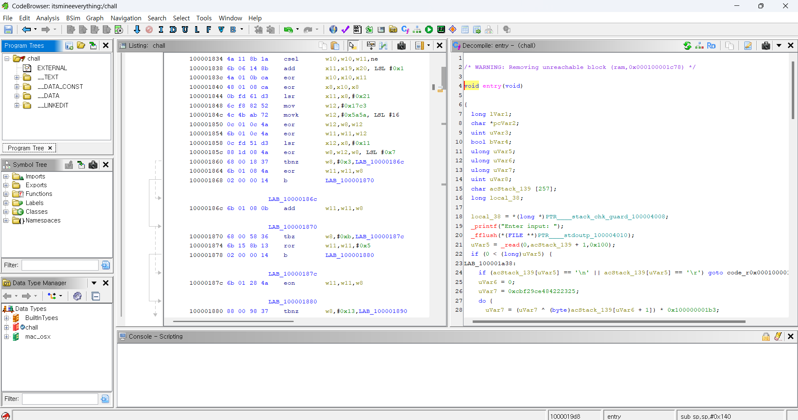

# SSD CTF

 8월 30일날 SSD CTF에 다녀왔다

 전날 문제를 못풀어서 남은 리버싱 문제가 2개밖에 없었다

## its mine everything

처음부터 이거 하나만 풀어보자라는 마인드로 도전한 문제였다.

`Mach-O 64-bit arm64 executable`이라고 아이다에서 열리지도 않았다.

~~아이다 프로도 이상하게 작동을 안했다~~

그래서 열심히 **기드라**를 깔아서 main 파일을 열었다

드디어 `chall`파일을 열었다!!

플래그 조건을 쉽게 요약하면

"입력한 문자열을 **FNV-1a 64bit 해시한 후 복잡한 비트연산은 한 결과가`_TARGET_SLOT` 값과 일치**하면 `Correct!` 출력"

### 못 풀었던 이유..??

문제 파일 종류가 **macOS ARM64(Mach-O) 실행 파일**이라서 윈도우나 리눅스에선 안 열려서 계속 정적 분석으로 `_TARGET_SLOT` 값을 찾아볼려고 시도했지만 **`_TARGET_SLOT` 이 실행했을 때 초기화되기 때문에 정적 분석으론 찾는 것이 사실상 불가능**했다

~~끝나고 들어보니 안티 ai 문제였다고..~~
