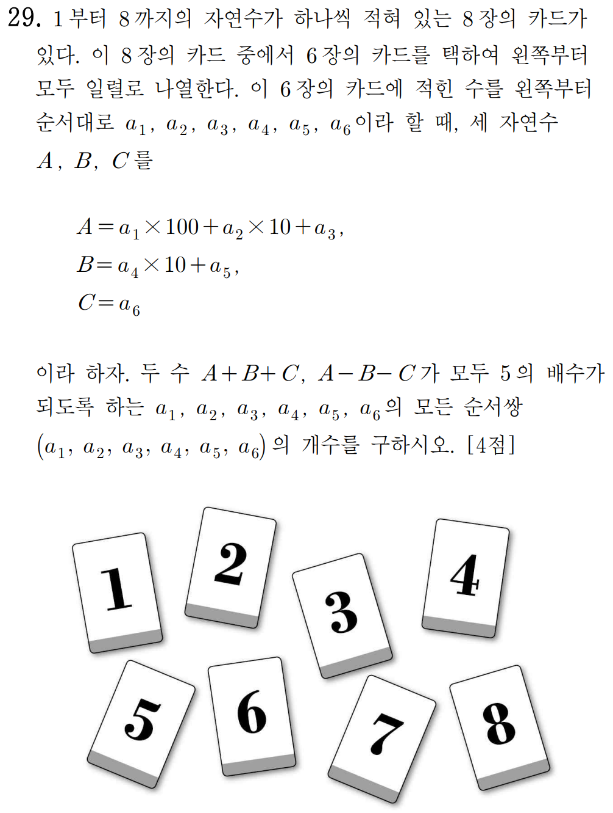

며칠 전에 9월 모의고사가 있었다. 이번 1학년 수학은 작년보다 꽤 등급컷이 낮았는데 나는 문제의 전반적인 난이도가 상승한 것이라고 느꼈다. 그럼에도 쉬운 경우의 수 문제도 오답률이 많이 높았는데 혹시라도 1학년 친구들중 이 오답률에 기여했다면 조금 반성하도록 하자.

그럼 한번 이번 모의고사에서 오답률 1,2위인 29,30번 문제를 한번 보도록 하자. 사실 29번은 매우 쉬운 편인데 오답률이 높은 이유중 하나는 29번과 30번에 대한 두려움 때문에 많이 시도조차 안한게 아닐까 싶다. 이번 경우의 수 문제는 21번이 가장 어려웠다. 케이스 분할을 잘 하면 되긴 하지만 좀 복잡한 감이 있었을 것이다. ~~(아무튼 객관식이니 못 풀었다면 잘 찍기라도 하자)~~

$A+B+C$와 $A-B-C$가 5의 배수가 되도록 하는 순서쌍의 개수를 구하는 문제이다.

여기서 배수의 정의에 대해 좀 살펴볼 필요가 있는데 $0$은 모든 수의 배수이고 $-5,-10$과 같은 수도 5의 배수이다.

$100$과 $10$은 5의 배수이므로 $a_1,a_2,a_4$는 우리의 관심사가 아니다. 따라서 $a_3+a_5+a_6$와 $a_3-a_5-a_6$가 5의 배수가 되도록 하는 순서쌍의 개수를 구하는 문제로 볼 수 있다.

트러스트 학생들은 정수론에 대한 기본 지식이 있다고 생각하고 저 문제상황을 수식으로 써보면 다음과 같다.

$$a_3+a_5+a_6 \equiv 0 \pmod 5 $$
$$a_3-a_5-a_6 \equiv 0 \pmod 5 $$
합동식의 성질에 의해 두 식을 더할 수 있다.

$$2a_3 \equiv 0 \pmod 5$$
$\gcd(2,5)=1$이므로 합동식의 양 변에 2로 나눌 수 있다. 

$$\therefore a_3 \equiv 0 \pmod 5 $$
여기서 5의 배수인 카드는 5밖에 없으므로 $a_3=5$가 된다.

그럼 이제 고려해야 할 것은 $a_5+a_6=5$, $a_5+a_6=10$, $a_5+a_6=15$이 3가지 경우만 보면 된다. 여기서는 가짓수가 많지 않으므로 직접 구해보면 총 12가지가 나온다. 3개를 정하고 남은 카드 5장을 $a_1,a_2,a_4$에 배분하는 가짓수는 60가지다.

따라서 답은 $12 \cdot 60=720$

----
이번 시험에서 가장 어려웠을 30번을 한번 보도록 하자. 이 문제를 풀 때 내가 어떻게 접근하는지를 좀 자세히 적고 계산과정은 중간중간 생략한다.

문제에 조건이 너무 많고 못생겨서 읽기도 싫을 것이다. 
조건을 잘 보면 $f(x)-g(x)$와 $f(x)-h(x)$의 곱이 **중복을 포함한 4개의 근**을 가짐을 알 수 있다. 이게 이 문제를 푸는데 **가장 중요한 접근**이다. 이 정보를 토대로 가능한 그래프 개형을 추론해야 문제를 해결할 수 있다. 조건식에 $f(x), g(x), h(x)$를 대입하기에는 너무 복잡한 꼴이 나올 것으로 예상되니 다른 방법을 생각해보자.

$n$으로 가능한 숫자가 $3$가지 밖에 되지 않으므로 다 넣어보자. 그러면 $n$이 1일 때 중근을 3개 가지고 나머지 다른 실근을 하나 가진다. $n$이 2일 때 서로 다른 중근 2개를 가지게 된다. $n$이 3일때는 식의 **대칭성**에 의해 고려할 필요가 없다.

따라서 해가 $\alpha, \alpha, \alpha, \beta$가 되거나, $\alpha,\alpha,\beta,\beta$가 되는 꼴을 고려하자. 

3개의 근이 서로 같은 경우를 먼저 보자. 가능한 그래프 개형은 다음과 유사한 꼴이라는것을 알 수 있다. 

그런데 $g(0)=h(0)$이다. 따라서 실제로 가능한 개형은 다음과 같다.

그러므로 $f(0)=7$이라는 정보를 이용해 $a,b$를 구하고 사각형의 넓이를 구하면 된다.
그렇게 구하면 $95$가 나온다.

다음 경우를 보자 두 중근을 갖는 경우인데 한 점 $(0,7)$에서 이차함수에 접하는 두 직선을 가진다는 의미로 해석할 수 있다. 여기서는 $f(x)-g(x)=0$, $f(x)-h(x)=0$에서의 판별식이 0이 되도록 하는 $a,b$값을 구할 수 있다.

그렇게 하여 넓이를 구하면 $68\sqrt{5}$가 나온다. 

$$M=68\sqrt{5}, \ m=95 \\ M+m=95+68\sqrt{5} \\ \therefore p=95, \ q=68 \\ \therefore p+q=163 

