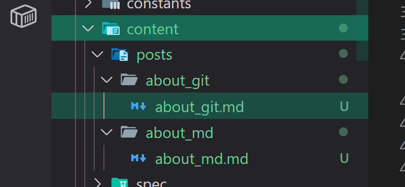

## 서론
---

깃허브 블로그를 통해 자신이 학습한 내용(TIL)에 대해서 올리게 될 것이다. 굳이 깃허브 블로그를 선택한 이유는 깃허브의 기본적인 사용 방법을 알아두면 나중에 정말 편해질 것이고, 마크다운을 통해 작성할 수 있는 것이 많기 때문이다.

어떤 글을 올릴 지는 본인의 자유로 기본적으로는 `보안`을 주제로 하지만 이외의 `알고리즘`, `하드웨어` 등 IT와 관련된 어떤 것이든 올려도 된다. (ex. 출전한 CTF 라이트업, 프로그램 설치 방법, 연구한 내용 등)

## 본론
---

### TIL이란?

TIL은 Today I Learn의 약자이다. 노션이나 깃허브 등에 작성하여 올리는 경우가 많으며, 자신이 학습한 내용을 돌이켜 보기에도 좋고 포트폴리오로 사용하기도 한다. Trust 블로그 작성의 목적은 분명히 각자의 속도가 다르기 때문에 자신이 학습한 내용을 정리하여 돌이켜 보도록 하고 다른 사람이 작성한 내용도 보면서 학습을 공유하기 위해서이다.

### 깃허브?

깃허브 Organization의 레포지토리를 통해 관리되는 블로그인만큼 글 작성과 업로드 또한 깃허브를 통해 이루어진다.

- [[Git] 뉴비를 위한 Github 사용법 총정리 (CLI ver)](https://sseozytank.tistory.com/41)
- [[Git] 뉴비를 위한 Github 브랜치(branch) 가이드 (CLI ver)](https://sseozytank.tistory.com/107)
- [[Git] Github에서 Pull Request(PR) 올리는 방법](https://dev-chim.tistory.com/entry/Git-GitHub-Pull-RequestPR-create)
  
깃허브에 관한 사용법은 이미 잘 정리된 글과 자료들이 많으니 생략하도록 하겠다.

우리는 원격 저장소에서 로컬 환경에 가져온 다음, 각자의 닉네임으로 브랜치를 만들어서 PR을 날릴 것이다. 내용을 확인하고 문제점이 없는지 확인하면 한 번에 merge 할 예정이다.

### 블로그 작성?

원격 저장소에서 로컬 환경으로 가져오면 무수히 많은 디렉토리들이 보일 것이다. 이 중 블로그 작성을 위해 건드려야 할 곳은 `src/content/posts/`이다. 해당 디렉토리를 확인하면 이미 디렉토리가 몇 개 존재할 것인데, 하나의 디렉토리가 하나의 글이라고 생각하면 된다. 가령 해당 글의 경우 `src/content/posts/about_git/` 디렉토리에 관리되고 있고 그 아래의 `about_git.md`가 해당 글의 내용이고 `img` 디렉토리의 사진들이 해당 블로그 글에 사용되는 이미지가 저장된 디렉토리이다.

따라서, 자신이 글을 작성할 생각이라면 `src/content/posts/`에 새로운 디렉토리를 생성하고 그 아래 `Markdown` 형식으로 글을 작성하면 된다. 마크다운 형식이 처음엔 어색할 수 있지만 이미 작성된 다른 글들을 참고하며 쓰다 보면 익숙해질 것이다. (디스코드 채팅도 마크다운이 지원된다.)

[wsl - vscode 연동시키기](https://junk-s.tistory.com/entry/WSL-VSCode%EC%97%90%EC%84%9C-wsl2-%EC%82%AC%EC%9A%A9%ED%95%9C-linux-%EA%B0%9C%EB%B0%9C%ED%99%98%EA%B2%BD-%EA%B5%AC%EC%B6%95)

필자는 wsl에서 vscode를 연동하여 사용하고 있는데 자신도 wsl에 구축하고 글을 작성할 것이라면 위 글을 참고하면 좋을 것이다.

## 결론
---

정리하자면 블로그 작성 과정은 이렇다.

브랜치(자신의 닉네임)에서 글 작성 -> PR 날리기 -> 한 번에 머지

처음 깃허브를 사용하면(특히 협업에서) 뭔가 잘못하고 있는 건 아닌지 쫄(?) 수 있는데 실수해도 괜찮으니 쫄지 않기를 바란다. 실수하면서 배우는 것이고 모두 아직 배울 것이 많은 사람들이기 때문에 당당하게 그냥 사용하기를 바란다. 뭔가 잘못되면 고치면 되고, 질문하면 된다.