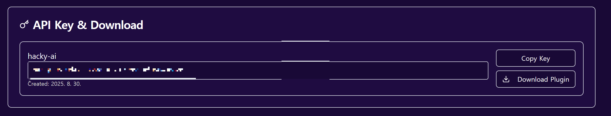

리버스 엔지니어링을 하면서 당신은 수많은 이름 없는 함수, 변수들(**sub\_12345,v1,v2,v3**)을 보아왔을 것이다. 이 변수는 뭐고 저 함수는 뭘 하는 것인지 알아서 분석해야 했지만... **그런 시대는 이제 끝났다...!** 이번에 소개할 IDA 플러그인은 코드의 실행 흐름을 분석해 자동으로 AI가 함수의 동작을 정리해 주고, 함수와 변수들을 리네임해주는 플러그인이다. 이번 글에서는 hacky-ai에서 만든 ai reversing assistant 플러그인의 설치법과 그 사용법을 소개하고자 한다.

# 설치방법 

[https://hacky-ai.com/](https://hacky-ai.com)

위 링크로 접속 후 회원가입을 한다.



회원가입 후 API 키를 발급받은 다음 복사해 놓는다.


[github.com](https://github.com/Hacky-AI-Dev/AI-Reversing-Assistant)

그 다음 위 깃허브 링크로 접속해 파일들을 다운받는다.

```
pip install -r requirements.txt  
  
pip install aiohttp>=3.8.0 pydantic>=1.10.0 asyncio-compat>=0.1.2 typing-extensions>=4.0.0
```

의존성을 고려해 필요한 파이썬 패키지들도 cmd에서 명령어를 통해 다운받는다.


아까 다운받은 ai\_reversing\_assistant.py를 코드 에디터에서 열어 발급받은 API 키를 복붙해준다.


그리고 IDA 프로그램 디렉토리를 열어보자. plugins라는 폴더에 아까 썼던 ai\_reversing\_assistant.py 파일을 그대로 옮겨준다.
위 안내사항에 잘 따랐다면 세팅은 다 마친 것이다.

# 사용법


아무 프로그램이나 가져와서 IDA로 열어보았다. 이름이 없는 함수들과 변수들이 보인다.


함수 이름을 클릭하면 노란색으로 하이라이트가 뜬다. 이 상태에서 **Shift+E**를 눌러주면..


ai가 함수를 자동으로 분석하고 이름을 바꿔준다.


변수도 똑같이 **Shift+E**로 분석 가능하다.


로그 창에 변수 이름을 바꾼 이유도 나온다.


~~솔직히 GPT한테 코드를 그대로 넘기면 분석을 다 해주긴 하지만~~ 이런 방법도 있다는 것을 알려주고 싶었다.

이 글을 읽는 모두 다들 **이지 리버싱** 하기를 바란다.