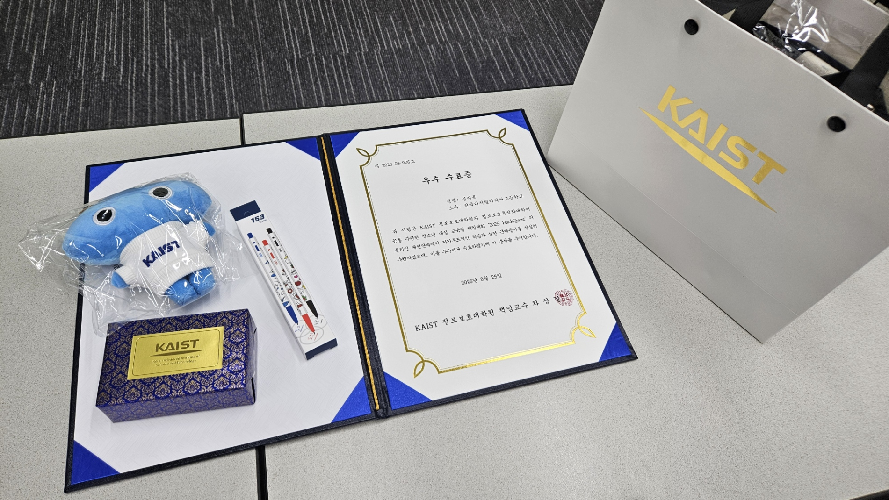
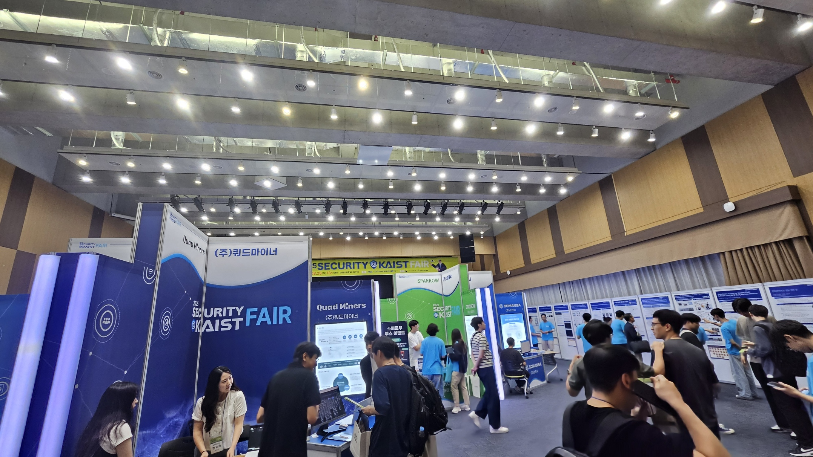

카이스트 주관 교육형 해킹대회 HackQuest 본선에 다녀왔다. 카이스트는 처음 가봐서 매우 설렜다.

대전까지 9시까지 도착한 후 9시부터 바로 대회가 시작되었다.

....결과부터 말하자면 암호학 문제 하나빼고 전부 못 풀었다. 문제들이 다들 심상치 않았다. 분야별로 3문제씩 나왔는데 크립토는  GPT에 바로 뚫리는 문제 하나 빼고 모두 0솔에 리버싱도 첫 문제 두 명 푼 거 빼면 다 0솔이었다. 난이도가 엄청나게 어려웠다. 난 첫 문제도 못풀었다. 그것도 굉장히 어려운 문제였다. 각각 패킷 분석, 러스트,C++ 문제가 나왔다. 특히 내가 모르고 못 하는 분야여서 접근이 어려웠다. 그에 비해서 웹은 그나마 할만한 편이었다고들 한다. 상위권 하는 사람들 보면 다 웹을 많이 풀었다. (물론 나도 도전했지만 어려워서 풀진 못했다) 포너블은 몰라서 도전도 안 했다..ㅎㅎ

 여러모로 재미있었다. 전체적으로 난이도가 아주 높았다. 또한 내 실력을 다시금 성찰하게 되는 계기가 된 것 같기도 하다. 아직 난 부족하다는 것을 새삼스레 느끼게 된다.

뭐 그래도 본선엔 올라갔기에 여러 카이스트 기념품과 우수 수강생 수료증을 받을 수는 있었다. 인형이 너무 귀엽다. 또한 오늘 대회하는 날과 Security@KAIST Fair 날이 겹쳐서 이것도 구경해볼 수 있었다. 대회 참가자에 한해 무료입장이었다.

카이스트 학생들과 대학원생들이 쓴 포스터 논문들, 여러 체험 부스를 구경했다. 정보 보안 박람회였기 때문에 대부분 매우 흥미로운 주제들이었다. 재미있게 관람하고 왔다.

 

또한 박사, 석사과정을 밟고 계신 다양한 분들의 연구 발표를 들을 기회도 있었다. 토르 네트워크에서의 도스 공격 방어법, 커널과 관련한 연구, 블록체인 안정성, 이더리움 프론트러닝 어택 등 정말 유익한 주제의 연구 발표를 들을 수 있었다. 인생에 몇 번 들어볼 수없는 아주 신기한 내용이었다.

 

앞으로 해킹 공부를 더 열심히 해야겠다. 1솔만 한게 마음에 너무 걸린다. 화이팅하자...
