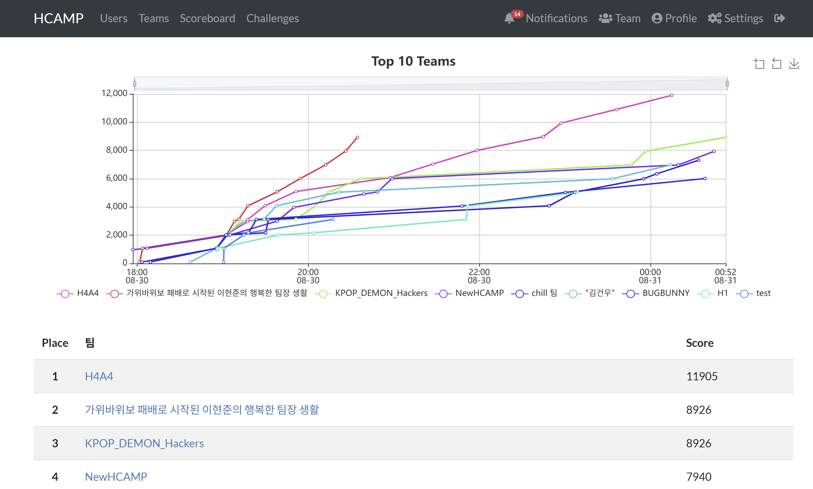
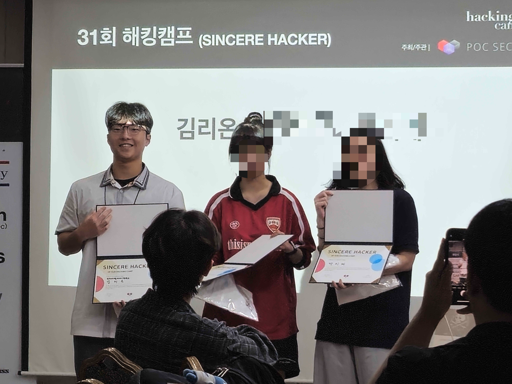

2025 해킹캠프에 다녀왔다. 서류 쓰고 나서 불합격할까봐 굉장히 가슴졸이고 있었는데 붙어서 너무 좋았다.

장소는 남산에 있는 서울유스호텔이었다. 와서 조를 랜덤으로 정했다. 고등학생들보다는 대학생들이 더 많았다. BoB를 하셨던 분들도 있었고 화이트햇 스쿨을 하셨던 분들도 있었다. 다양한 곳에서 다양한 분들이 오셨다. 한세사이버보안고등학교에서 온 친구와도 친해졌고 경북소마고에서 온 친구와도 친해졌다. 다른 고등학교에 인맥이 생기니까 좋았다.

 

보안업계에 오래 계셨던 분들, AI,블록체인등의 분야를 공부하신 분들, 윈도우 커널 취약점을 찾는 프로젝트를 하셨던 분들의 발표도 들을 수 있었다. 정말 많은 양의 지식들을 겉핥기식으로 체험해볼 수 있었다.

 

오후에 발표를 듣고 저녁을 먹은 후에는 HCAMP CTF가 시작이 되었다. 처음에 맛보기 문제를 풀었는데 너무 어려워서 놀랐다. 그 후에 본격적으로 CTF가 시작되었고 우리 팀은 열심히 문제를 풀었다. CTF 중간에 야식도 제공되었다. 치킨 맛있게 먹으면서 GPT를 열심히 갈구며 문제를 풀었다.

결과는 우리팀(H4A4)가 우승했다. 다 포기하지 않고 열심히 문제에 집중한 덕분이었다.

새벽 한시에 CTF가 끝나고 승리를 만끽하다가 잤다. 다음날에도 발표들을 들었다. 모든 발표들을 다 듣고 나니 커널 관련 발표와 Web3, 블록체인, AI 보안이 기억에 남았다. 나중에 공부해보고 싶다는 마음이 생겼다. 

 

중간중간에 숙명여자대학교 정보보안 동아리 SISS에서 준비한 이벤트들도 있었다. 레크레이션 활동같은 것들을 했는데 열심히 해서 내가 1등을 했다. 상품으로 다음 해킹캠프 참가권을 얻었다. 나이스!!

마지막에는 시상식을 했다. 성실한 해커 3명, 베스트 해커 1명, ctf 우승팀에게 상을 줬다. 내가 발표할때 열심히 듣고 질문도 많이 해서 그런지 성실한 해커 3명 안에 뽑혔다. 나머지 두명도 우리 조였다. 상품으로 이번에 열리는 PoC 국제 컨퍼런스 입장권과 티셔츠를 받았다. PoC 컨퍼런스 입장권은 80만원정도 된다고 하는데 무료로 얻어서 너무 좋았다. 꼭 가야겠다.

그리고 CTF 위너 상도 받았다. 티셔츠 받았는데 이 티셔츠가 성실한 해커 상으로 받은 티셔츠보다 개인적으로 더 예쁜 것 같다.

좋은 경험 한 것 같다. 여러 곳에서 온 사람들과 소통해보고 내 진로에 대해서도 이미 그 분야에서 일하고 계신 분들께 조언을 받으며 깊게 생각해볼 수 있었던 것 같다. 정말 나중엔 발표자로 참여해보고 싶다.