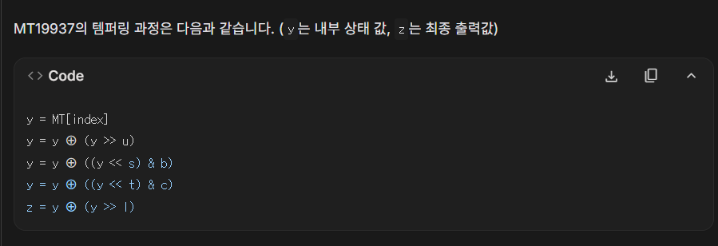
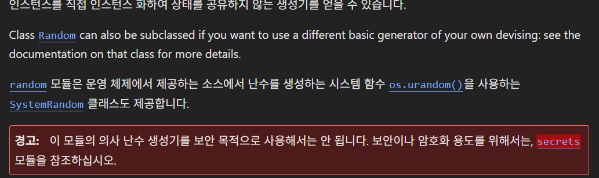
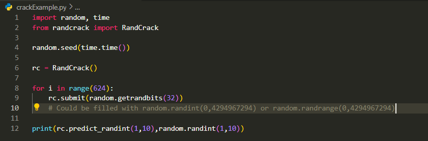
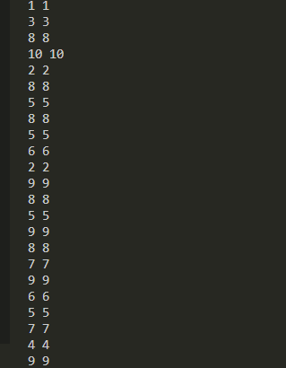

글을 한동안 쓰지 못했다. ctf가 많기도 했고 공부나 수행평가 등으로 바빠서 블로그에 신경 쓸 여유가 없기도 했다. 그래서 오늘은 메르센 트위스터 상태 복구와 python random crack 방법에 대해 알아보고자 한다.

# 메르센 트위스터
1997년에 마츠모토 마코토와 니시무라 다쿠지가 개발한 유사난수 생성기이다. 난수의 반복 주기가 메르센 소수이기 때문에 메르센 트위스터라는 이름으로 불린다. 매우 질이 좋은 난수를 빠르게 생성할 수 있으나 암호학적으로 안전한 유사난수 생성기가 아니기 때문에 상태를 복구하고 다음 수를 예측할 수 있다.

## 동작 원리
크게 **초기화(Initialization)**, **추출 및 변조(Extraction and Tempering)**,  **상태 업데이트(Twisting)**로 나눌 수 있다. 메르센 트위스터는 내부적으로 n개의 w비트 정수로 구성된 상태 벡터를 가지고 있다. MT19937의 경우 32비트 624개로 상태 벡터가 구성되어있다. 초기화  단계에서는 32비트 정수 seed 값을 받아서 상태 벡터의 첫번째 요소에 저장한다.  나머지 상태 벡터 요소는 상수를 이용해서 특정한 비트 연산을 하며 채운다. 이 과정을 통해서 단일 시드값으로부터 예측하기 어려운 초기 상태 벡터 전체가 생성된다.

추출 및 변조 단계에서는 위 과정에서 만들어진 초기 상태 벡터에서 624개의 32bit 숫자를 하나하나씩 가져온다. 하지만 그대로 가져오면 통계적으로 분포가 좋지 않을 수 있기 때문에 Tempering이라는 변환과정을 거쳐 수를 가져온다. Tempering 또한 여러 상수들을 이용한 비트 시프트 및 xor 연산이다. 최종적으로 템퍼링을 거쳐서 우리가 32bit 수를 얻을 수 있다.

상태 벡터에 있는 n개의 수를 모두 사용하고 나면 새로운 n개의 숫자를 생성하기 위해 Twisting이라는 과정을 수행한다. 이 또한 복잡한 비트 연산이기 때문에 따로 설명하지 않겠다. Twisting 과정을 거치면 n개의 숫자로 이루어진 상태 벡터가 새로운 값들로 갱신된다.

## 상태 복구 원리
아까 메르센 트위스터의 작동 원리를 짧게 설명했다. 

그리고 이건 Gemini가 말해준 MT19937의 Tempering 과정이다. 메르센 트위스터가 암호학적으로 안전하지 않은건 Tempering 연산이 **선형적인 비트 연산**이라는 것에 있다. 이는 Tempering되어 나온 32bit 수를 역연산을 통해 복원할 수 있다는 것이고, 복원을 반복해 최종적으로 n만큼 숫자를 모으면 시드를 알지 않아도 받은 수만으로 내부 상태 벡터를 완전히 복구해낼 수 있다.

## 파이썬 random module 크랙
파이썬의 random 모듈은 MT19937을 사용한다. 즉, 크랙이 가능하다는 뜻이다.

파이썬 random 모듈 문서의 일부이며, 이 문서에서도 보안 목적으로 사용해서는 안된다며 경고가 써져있다.

하지만 MT19937에서 상태를 복구하려면 복잡한 Untempering 연산을 해야 한다. 그래서 이를 간편화하기 위해서 randcrack 모듈을 쓸 수 있다. (https://github.com/tna0y/Python-random-module-cracker)

예시 코드는 위와 같다. random 모듈에서 **getrandbits(32)**를 사용해 템퍼링된 32bit 수를 가져오고 randcrack 모듈을 불러와 만든  **RandCrack** 객체에 그 수를 624번 넣는다. 그럼 상태 벡터를 복구하기 위해 충분한 수가 모이고 객체는 자동으로 상태를 복원한다. 그렇게 같은 상태 벡터를 가지게 된 RandCrack 객체는 현재 random 모듈과 같은 값을 제공하게 된다.

RandCrack 객체와 random 모듈이 1과 10 사이에서 랜덤으로 고른 수를 여러번 출력해봤다. 예측한 값이 정확히 같은 것을 볼 수 있다. 내부 상태 벡터를 완전히 복구했기 때문이다.