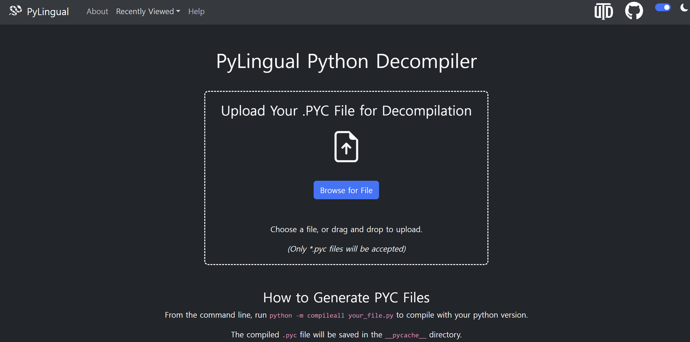

# 서론
CTF를 나가면 리버싱 문제를 풀 때 `.pyc`라는 파일 확장자를 심심치 않게 마주칠 수 있을 것이다. 난 CTF에서 .pyc 파일을 처음 보고 당황했던 경험이 있다. 파이썬인데 코드를 볼 수 없었던 이 파일이 골칫거리였다. 그래서 오늘은 컴파일된 파이썬 파일인 `.pyc` 파일을 **디컴파일**하는 방법에 대해 알아보고자 한다
# Pyc란
`.pyc`는 쉽게 말하면 컴파일된 파이썬 파일이다. 파이썬은 인터프리터 언어인데 컴파일이라니. 신기하다. 정확히 설명하자면 파이썬 소스코드 파일인 `.py`를 실행할때 인터프리터가 바이트코드로 컴파일된 결과물이 저장된 파일이다. 사람이 읽을 수 없고 이미 버전에 맞는 바이트코드로 저장되었기 때문에 **버전이 맞지 않으면 실행할 수 없다.**

또한 여타 다른 파일들과 같이 매직넘버가 있다. 일반적으로 **4바이트**이며 버전 정보가 표시되어있다.
# uncompyle6를 통한 디컴파일
```
pip3 install uncompyle6
```
pyc를 디컴파일하기 위해서 **uncompyle6**를 설치해서 사용하는 방법이 있다.
위 명령어를 실행시키고 다운받자.

```python
import random
name = input("what is your name?")
age = input(f"Hello {name}! How old are you?")

computersAge = random.randint(17,20)

if computersAge == age:
    print("Lets be friends!")
else:
    print("Go away!")
```
이런 내용의 `new.py` 파이썬 코드를 `new.cpython-313.pyc` 파일로 바꾸고 uncompyle6를 사용해서 디컴파일해보겠다.
```
uncompyle6 new.cpython-313.pyc
```
```
I don't know about Python version '3.13' yet.
Python versions 3.9 and greater are not supported.
```
**안된다.**

위 출력을 보면 알겠지만 사실 uncompyle6는 파이썬 버전을 **3.9까지밖에 지원하지 않는다.**
그래서 uncompyle6는 사실 거의 쓰지 않는다.

# pylingual을 통한 디컴파일

**pylingual**은 일반적으로 pyc를 디컴파일하는데 쓰는 사이트이다. (https://pylingual.io/view_chimera?identifier=e8433b1d34f3d1a3f9ab90a0f57581cadee70d19e793b95b346192bf9b070a74)
온라인상에서 사용할 수 있다. 사용방법은 간단하다. `.pyc` 파일을 드래그 앤 드롭하면 자동으로 디컴파일해준다.

아까 전의 그 `new.cpython-313.pyc`를 **pylingual**에서 디컴파일한 모습이다. 소스코드를 그대로 볼 수 있다.

# pyinstaller로 변환한 exe파일 디컴파일(응용)
**pyinstaller**는 `.py`파일을 `.exe`로 바꿔준다.
아까 전에 얻은 pyc 디컴파일 지식을 활용하면 **pyinstaller**에 의해 변환된 `.exe`도 분석 가능하다. 

`new.py`를 **pyinstaller**를 사용해 `new.exe`로 바꾸었다. 이제부터 분석을 시작해보겠다.

이것도 따로 사이트가 있다. (https://pyinstxtractor-web.netlify.app/)
이 링크에 들어가서 exe 파일을 zip으로 추출 가능하다. 

추출한 모습이다. 그리고 여기서 보면 아까의 new.pyc가 보인다. 이걸 pylingual에 돌리면 디컴파일이 가능하다. 

---
이렇게 pyc를 디컴파일하는 방법에 대해 알아봤다.
pyc 디컴파일은 매우 쉽다. 디컴파일된 코드도 원 소스코드와 100% 똑같기 때문에 분석하기 쉽다. 