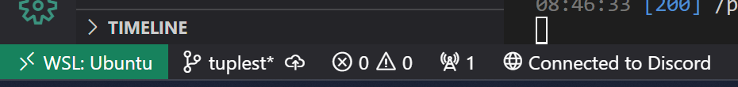
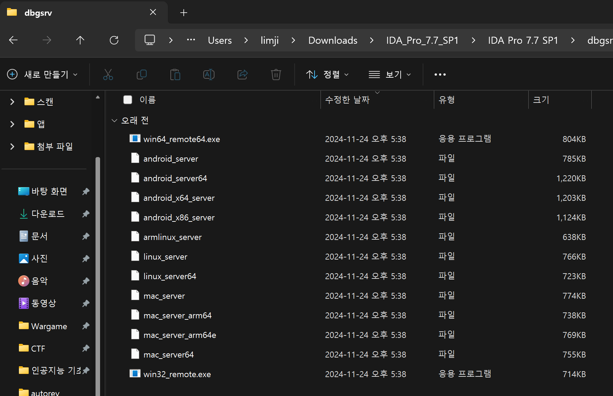
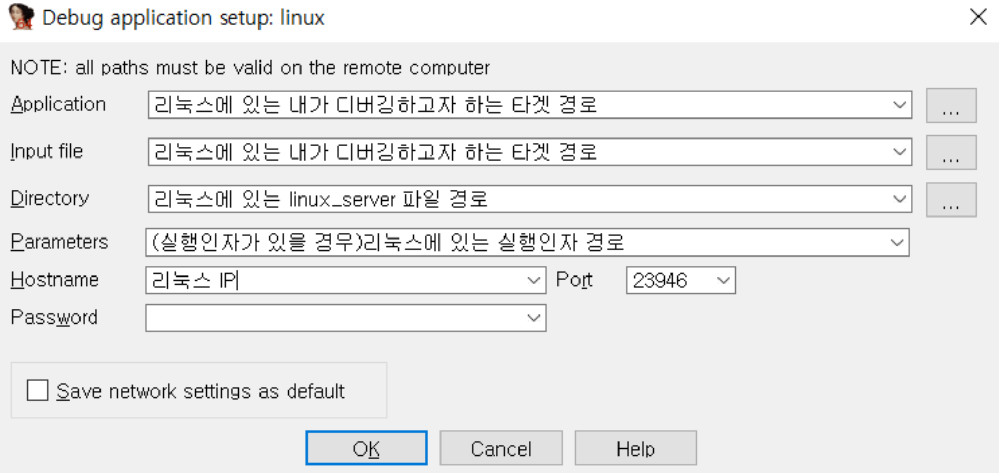
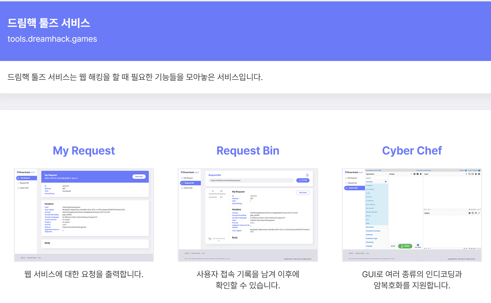

## tools

---

CTF를 잘 뛰기 위해서 적절한 툴을 찾는 능력은 중요하다. 정말 분석하기 어렵다고 느껴지는 요소들도 툴 하나만으로 쉽게 풀이할 수 있다. 과거였다면 툴이 없거나 존재하는 툴이 불편해서 자신이 만들거나 깡분석해야했겠지만 우리는 살기 쉬운 시대를 살고 있기에 구글링과 깃허브를 찾아보는 습관 및 능력을 길러두도록 하자. 이 글에서는 아주 대표적이지만 가끔씩 모르는 사람이 있는 요소들을 적어보도록 하겠다.

## vim

---

cli 환경에서 코드를 짜야 할 일이 많은 포너블, 때때로 만질 일이 생기는 리버싱과 같이 쉘에서 코드를 짜야 할 일이 많은 사람들은 기본적으로 알아야 하는 도구이다. `vim`은 `vi`의 업그레이드 버전으로 cli 환경에서의 코드 짜기를 편리하게 해주는 편집기이다.

|    Mode    |                                       Description                                       |
|------------|-----------------------------------------------------------------------------------------|
|  `Normal`    | vim 실행 시 기본 설정 모드 / 커맨드 입력 가능 가능                                                                              |
|  `Insert`    | 글 삽입 모드 / 내용 수정 가능                                                                              |
|  `Visual`    | 블록 단위 선택 모드                                                |

`vim`에는 기본적으로 위와 같은 3가지 모드가 있다. `vim [filename]`이라는 명령어를 통해 파일에 진입하면 기본적으로 `Normal` 모드인데 `i` 등의 같은 커맨드를 통해 `Insert` 모드에 진입할 수 있다. `Insert` 모드에서는 파일의 내용에 수정이 가능하다. `Visual` 모드는 잘 쓰이지 않지만 블록 단위로 내용을 선택할 수 있다는 점에서 장점이 있다.

|  Command  |                             Description                                               |
|-----------|----------------------------------------------------------------------------------------|
|   `i`     | 현재 위치에서 입력(Normal -> Insert 모드 전환)                                            |
|   `:w`    | 내용 저장                                                                              |
|   `:q`    | vim 종료                                                                               |
|   `:wq`   | 저장 후 종료                                                                            |
|   `:~!`   | ~ 커맨드 강제(force) 실행                                                                |
|   `I`     | 줄 맨앞에서 입력                                                                        |
|   `a`     | 현재 위치 다음에서 입력                                                                   |
|   `A`     | 줄 끝에서 입력                                                                          |
|   `dd`    | 한 줄 삭제                                                                                |

기본적으로 `vim`은 마우스가 개발되기 이전, 키보드만 존재한 시절 실사용을 위해 개발된 편집기이다. 따라서 각 키에 입력된 커맨드의 종류가 매우매우 많고 위는 정말 극소수에 불과하다. 수가지의 커맨드 중에서도 위 표의 5번째까지의 커맨드는 사용을 위한 필수 커맨드이다. 내용은 설명과 같고 사용을 위해서 `꼭` 외워두도록 하자. 이 밖의 명령어들 또는 여기에 적혀 있진 않지만 존재하는 수많은 명령어들은 알면 도움이 되므로 시간이 남을 때 틈틈히 보는 것도 나쁘지 않을 것이다.

`vim`과 비슷한 도구로는 `vi`, `emacs`, `nano`가 있으며 초보자에게는 `vim`보다 `nano`가 더 적합할 수 있다. 이러한 cli 환경에서의 편집기 사용법은 `PWN에게는 필수이고` 다른 사람들도 알면 유용하니 학습해보길 바란다.

## code .

---

많은 사람들이 코드 편집기로써 `Visual Studio Code`를 사용하고 있다. 아무리 wsl(cli)에서 코드를 작성할 일을 줄인다 하더라도 코드 작성은 필수불가결할 것이며 적은 양의 코드는 위의 `vim`과 같은 편집기로 가능하겠지만, 길어지면 길어질수록 잘 만들어진 편집기/IDE의 도움이 절실할 것이다.

`code` 명령어는 그러한 사람들에게 도움을 주는 명령어로 쉘에서 원하는 디렉토리를 `vscode`로 열 수 있게 해준다. 사용을 위해서 먼저 위 사진의 보이는 `Vscode Extension`을 설치해주도록 하자.

설치를 완료하면 사진처럼 좌하단에 초록색 버튼이 생길 것이다. 해당 버튼을 클릭하여 `wsl`과 연결하거나 연결을 종료할 수 있다.
이후부터는 `wsl`에서 원하는 디렉토리에 이동한 후 `code .` 명령어를 실행하면 그 디렉토리가 `vscode`로 열릴 것이다. `code .` 명령어는 꼭 `wsl`만이 아니라 윈도우 파워쉘에서도 사용이 가능하니 참고 바라고 `code .`에서 `.` 대신 다른 경로를 입력하여 열 수 있다는 사실을 인지하길 바란다.

개인적으로 `PWN`은 위 방법도 좋지만 간단한 코드를 작성할 때에는 `vim`을 적극적으로 활용하는 연습을 해주길 바란다.

## Remote Debugging

기본적으로 윈도우에서는 `ELF` 바이너리를 동적 분석할 수 없다. `ELF`는 `Linux` 시스템에서 돌아가는 바이너리이기 때문에 실행 자체가 불가능하기 때문이다. 하지만 `동적 분석 >>>>>>>>>>>>>>>>>>>>>>>>> 정적 분석`이라는 `Wane` 선배의 말씀처럼(나도 동의한다.) 동적 분석의 중요성은 생각보다 높고, 동적 분석이 아니라면 정말 분석하기 어려운 문제들도 많다. 

`ida`의 원격 디버깅은 이를 돕기 위해 나온 기능으로 `ida pro`에서만 가능하다. 요약하면 다음과 같다.

1. `ida pro`가 설치된 경로에서 `dbgsrv`라는 폴더를 찾는다.
2. 해당 폴더에서 자신이 디버깅하려는 파일에 맞는 OS 버전을 확인하고 파일을 복사한다. (linux_server64)
3. 복사한 파일을 자신이 사용하는 wsl에 붙여 넣고 실행 권한을 주어 실행시킨다.
4. `ida`에 들어가 파일을 열고 Debugger를 Remote Liniux Debugger로 설정한다.
5. Debugger -> Process Option 에서 알맞게 설정해주면 끝난다.

`dbgsrv` 폴더에 들어가면 위와 같이 파일들이 있는데 우리는 우분투 `wsl`에서 돌릴 것이므로 `linux_server64`를 가져온다.

디버거를 `Remote Linux Debugger`를 체크한다. (위 사진에서는 안 보인다.)

`f9`키를 누르면 디버깅이 시작될텐데 설정은 위와 같다. 다만 대부분은 기본적으로 설정되어 있을 것이니 `Hostname`과 `Parameters`(필요 시)만 신경 써주면 된다. `Hostname`은 그냥 127.0.0.1 넣어주면 된다.

`ida`를 통한 디버깅은 `c`언어 코드 단위로 실행된다. 따라서 `REV`들에게 가장 유용하며 `PWN`들은 웬만하면 `GDB` 쓰도록 하자.

## zsh

---

쉘은 커널과 사용자를 이어주는 다리의 역할이다. 이러한 쉘은 OS에 따라서도 다르고, 같은 OS여도 자신이 선택하기 나름으로 정해줄 수 있다. 당신이 `PWN`이라면 이미 쉘의 다른 종류를 봤다. 익스를 할 때 실행시키는 `/bin/sh`에서의 `sh`도 하나의 쉘이다.

| 특징 | sh (Bourne Shell) | bash | zsh |
|----|----|------|-----|
| 출시 시기 | 1977년 | 1989년 | 1990년대 초 |
| 편의성 | 불편 | 인터랙티브에 용이 | 가장 편리 |
| 커스터마이징 | 매우 제한적 | 제한적 가능 | 강력 |
| 확장성 | 거의 없음 | 중간 수준 | 매우 높음 |
| 실행 성능 | 빠름 | 약간 느림 | 가장 무거움 |

zsh은 다양한 방식으로 커스터마이징이 가능하고 자동완성 기능이 매우 잘 되어 있기에 많은 사람들이 사용한다. 그러나 무조건적으로 `zsh`이 더 좋은 게 아닌 개인의 취향 차이기 때문에 알아서 선택하길 바란다. `zsh`, `bash` 말고도 쉘의 종류는 다양하기에 궁금하다면 찾아보는 것도 좋을 것이다. `zsh`을 설치하고 싶다면 `oh-my-zsh`을 찾아보시길 바란다. 너무 생 설치라서 생략하겠다.

## Ghidra

기드라(Ghidra)는 미국 국가 안보국(NSA)에서 개발한 역분석 도구이다. 아이다 또는 바이너리 닌자와 달리 오픈 소스로 공개되어 있어 누구나 무료로 사용할 수 있다는 장점이 있다. 아이다의 파이썬 API 기능처럼 기드라에도 파이썬 API가 존재하기에 적절히 사용한다면 좋은 분석 도구가 될 수 있다. 사용해보고 싶다면 [Ghidra](https://bbangya22.tistory.com/entry/Ghidra-%EC%84%A4%EC%B9%98-%EB%B0%A9%EB%B2%95)와 같은 블로그 또는 드림핵 리버싱 강의를 참조해보길 바란다. pro가 아니면 `arm` 아키텍쳐의 분석이 불가한 아이다와 달리 기드라의 경우 무료로 `arm`과 같은 다양한 아키텍쳐의 바이너리를 분석할 수 있기에 장점이 있다.

### Wasm Plugin

::github{repo="nneonneo/ghidra-wasm-plugin"}

기드라를 이 글에 넣은 진짜 이유이다. `WASM`이란 `Web Assembly`의 준말로 웹 브라우저에서 실행하는 바이트코드 언어이다. 이름이 어셈블리와 관련 있는 것답게 정말 속도가 빠르다는 장점이 있다. 아주 가끔 `WASM` 바이트 코드를 역분석시키는 리버싱 문제가 존재하는데 이러한 문제를 풀이하기 위해서 진짜 바이트 코드를 분석하는 방법도 있지만, `WASM Plugin`을 사용해보는 것도 하나의 방법이자, 훨씬 더 쉬운 방법이다. 당연하게도 아이다는 `WASM` 바이트 코드를 역분석해주지 않는다. 이는 기드라 또한 마찬가지이다. 그러나 위의 플러그인을 설치하여 기드라에 적용시킨다면 `.wasm` 파일을 디컴파일하여 분석할 수 있어 아주 편리해진다.

`WASM` 리버싱 문제는 거의 나오지 않기는 하지만 알아두어서 나쁠 것이 없으니 기억해두도록 하자.

## dnSpy

::github{repo="dnSpy/dnSpy"}

`dnspy` 또한 아이다, 기드라와 같은 바이너리 역분석 도구 중 하나이다. 차이점은 `dnspy`를 통해서는 `.NET framework`로 만들어진 프로그램을 더 쉽게 분석할 수 있다. `C#`으로 작성된 프로그램과 `Uinity` 게임 리버싱을 할 일이 생긴다면 주저 말고 `dnspy`를 사용하도록 하자. 참고로 2024년까지는 `YISF` 예선 리버싱 문제에 유니티 게임 리버싱 문제를 하나 내는 게 전통이었다. 비록 올 해는 없었던 걸로 알고 있지만 아예 안 나오는 유형은 아니니 이것도 알아두도록 하자.

## Dreamhack Tools

드림핵 툴즈는 드림핵에서 제공하는 서비스로, 접속만으로 누구나 사용할 수 있다. `My Request`, `Request Bin`의 경우 웹해킹을 하는 사람들에게 큰 도움이 된다. (라고 들었다. 나는 리버싱이라서..) `Cyber Chef`는 암복호화 툴로 모르는 사람이 없을 것이라 생각하지만 그래도 몰랐다면 알아두자. 매우 유용하다.

## Comment 

잘 쓰자.