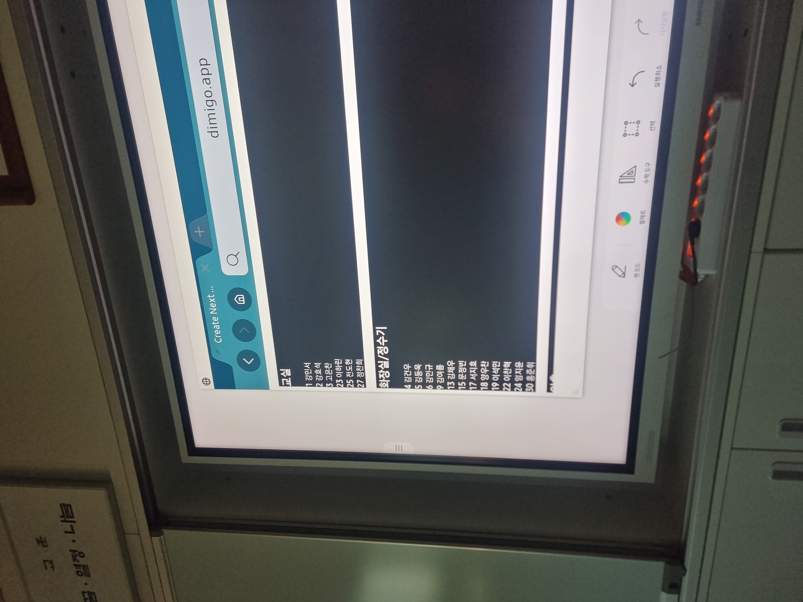
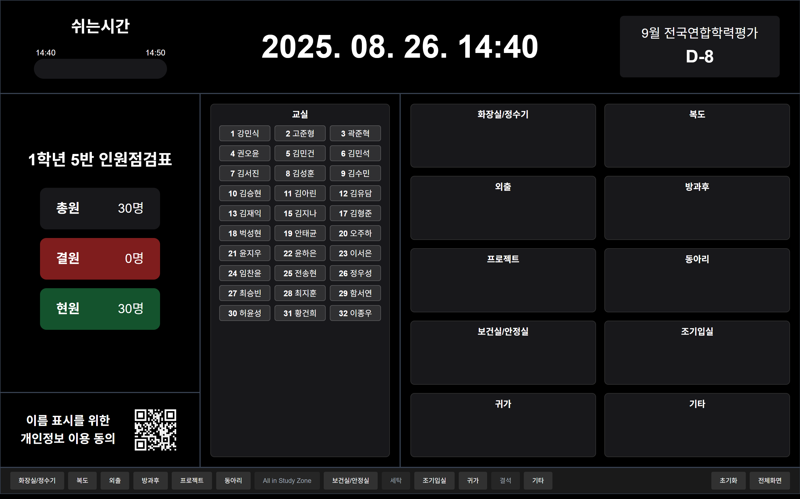
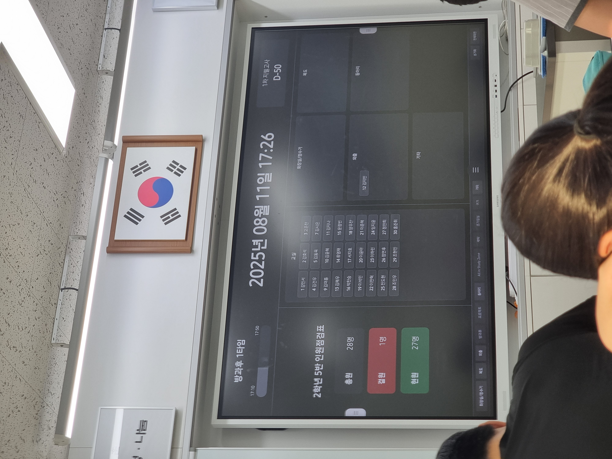

# 시작은 미약했다

여름방학 전에 학교에 전자칠판이 생긴다는 소식을 들었다.
전자칠판을 처음 써보는 것이 아니었던 나는 그 무궁무진한 활용 가능성에 대해서 잘 알고있었다.
그래서 "전자칠판에서 인원체크를 해보는 것이 어떨까" 하는 생각을 하게되었다.

이 프로젝트는 웹사이트로 진행했다. 전자칠판에 자체 웹 브라우저 기능이 있기 때문이다. 
프론트 및 백엔드에는 `Next.JS`를 사용했고, 데이터베이스는 `MongoDB`를 사용했다.
`Next.JS`와 `MongoDB`를 함께 사용한다면 별도의 서버 없이도 충분히 서비스 운영이 가능하다.

서비스를 개발하기 전엔 먼저 어떤 기능들을 넣을것인지에 대한 `기능 명세서`를 작성하는 것이 좋다.
기능 명세서를 작성하고 시작해야 가장 적절한 데이터베이스 테이블을 구축할 수 있고, 이후에 큰 기능을 추가하거나 수정하게 되면 불가피한 대대적인 코드 수정이 필요해질 수 있기 때문이다.

처음에 넣고자 했던 기능들은 아래와 같다.
- Drag&Drop 인원체크
- 총원 표시
- 시간 표시
- 일정 표시
- 원격 인원체크

방학 기간을 이용하여 틈틈히 개발했다.

# 항상 순탄하지는 않다



이 사진은 7월 25일, 방학에 학교에 와서 만들던 사이트를 테스트해보던 사진이다. 당시 나는 Tailwind CSS를 사용해서 사이트의 CSS 코드를 구성하고 있었는데, 이 대단한 전자칠판의 GPU와 브라우저는 Tailwind CSS를 지원하지 않는 것 같았다. 이 문제는 Tailwind CSS의 모든 요소를 모두 일반 .css 파일로 바꾸는 과정을 통해서 해결할 수 있었다.

# 프로젝트 구성

프로젝트는 크게 아래와 같은 구성을 가지고 있다.
```
├─api
│  ├─app
│  ├─attendance
│  │  └─date
│  ├─book
│  │  └─reload
│  ├─class
│  │  ├─activate
│  │  └─deactivate
│  ├─regist
│  ├─schedule
│  ├─seed
│  ├─students
│  │  ├─reset
│  │  └─[id]
│  ├─tv
│  └─visible-sections
│      └─reload
├─book
├─teacher
│  └─[id]
│      ├─book
│      ├─manifest.json
│      └─old
└─tv
    └─[id]
```
NextJS를 이용해서 한 프로젝트 내부에 프론트엔드와 백엔드를 모두 넣었다. 이를 통해 서버리스 기반 호스팅을 지원하는 `Vercel`호스팅을 통해 모든 것을 해결하였다.

`/api`폴더는 프론트에서 호출하는 모든 API를 정의하는 디렉토리이다. 이곳에서 `MongoDB API`를 호출하여 데이터를 가져오거나, 수정하기도 하고, 프론트엔드로 데이터를 보내 학생 핸드폰과 전자칠판에 지속해서 수정된 데이터를 표시한다.

## 전자칠판 동작 원리

전자칠판에서 백엔드로 10초마다 `POST` 요청을 보내 데이터를 가져온다. 이 과정에서 동시에 전자칠판에서 수정된 데이터의 DB 수정 처리 또한 진행된다. 

일반적이라면 수정 시엔 `PATCH` 메서드를 통해서 값을 수정하고, 10초마다 데이터는 `GET` 메서드를 통해서 진행 할 것이다. 하지만, 하루 6시간, 주 5일, 8개 반에서 작동될 API ENDPOINT를 계산하니 Vercel에서 제공하는 API 수로는 한계가 있었다. 이 때문에 `POST`요청으로 데이터 수정과 수집을 동시에 진행할 수 있게 하였다.

```typescript
export async function POST(req: Request) {
    try {
        const { searchParams } = new URL(req.url);
        const id = searchParams.get('id');
        const grade = searchParams.get('grade');
        const classNum = searchParams.get('class');
        
        console.log(`🔍 [DEBUG] GET 요청 - ${grade}학년 ${classNum}반`);

        // body에서 변경사항 가져오기
        const { updates } = await req.json();

        if (updates && Array.isArray(updates) && updates.length > 0) {
            const db = await getDb();
            
            const bulkOps = updates.map((update: PendingUpdate) => ({
                updateOne: {
                    filter: { 
                        id: update.studentId, 
                        grade, 
                        class: classNum 
                    },
                    update: { 
                        $set: { 
                            location: update.location,
                            ...(update.etcContent && { etcContent: update.etcContent })
                        }
                    }
                }
            }));

            if (bulkOps.length > 0) {
                await db.collection('students').bulkWrite(bulkOps);
            }
            const logEntries = updates.map((update: PendingUpdate) => ({
                action: 'update',
                collection: 'students',
                id: update.studentId,
                grade,
                class: classNum,
                changes: { location: update.location, etcContent: update.etcContent },
                timestamp: new Date(update.timestamp || Date.now()),
            }));
            if (logEntries.length > 0) {
                await db.collection('logs').insertMany(logEntries);
            }
        }

        await processBookReload({ grade, classNum });
        await updateVisibleSections({ grade, classNum });

        // 업데이트된 데이터 조회
        const [students, visibleSections] = await Promise.all([
            getStudents({ id, grade, classNum }),
            getVisibleSections({ grade, classNum }),
        ]);

        return NextResponse.json({
            students,
            visibleSections,
        });
    } catch (error) {
        console.error(error);
        return NextResponse.json(
            { error: 'Failed to fetch data' }, 
            { status: 500 }
        );
    }
}
```
보안을 생각한다면 쿠키에 있는 JWT 토큰 검증같은 과정이 필요할 것이다. 이 부분은 문제가 발생한다면 추후에 수정할 계획이 있다.

## 디자인



디자인은 어떻게 할까 고민이 많았는데, 장시간 화면에 띄워놔야 하기 때문에 다크 테마를 베이스로 기획하였다.

상단바에는 바 형태의 일정 표시, 시간 표시, D-Day 표시 등이 있는데, 이는 단지 `display: flex`를 이용해 중앙에 시계를 두기 위한 선택이었다.
즉, 원래 D-Day 기능은 예정에 없었다.

# 원격 인원체크

원격 시스템을 개발할 때는 인증 처리를 어떻게 해야할지 고민이 많았다.

모두에게 모두에 대한 수정 권한을 부여하는 것은 위험할 것 같았고, 디미고 학생들이 과연 이곳에 테러를 하지는 않을까? 하는 생각도 많이 들었다.

하지만, 인증을 추가하는 순간 서비스의 접근성이 확 떨어지기 때문에 이를 과감하게 표기하고 `학번 + 이름` 방식으로 인증하는 것을 선택했다.

```typescript

export async function PATCH(
  request: NextRequest,
  context: any
) {
  const { id } = await context.params;

  if (!id) {
    return NextResponse.json({ error: 'Missing ID' }, { status: 400 });
  }

  try {
    const db = await getDb();
    const { location, etcContent, grade, class: classNum, itf } = await request.json();

    if (!location || !grade || !classNum) {
      return NextResponse.json({ error: 'Missing location' }, { status: 400 });
    }

    const result = await db.collection('students').updateOne(
      { id, grade, class: classNum },
      {
        $set: {
          location,
          etcContent: (location === 'etc' || location === 'project') ? etcContent : undefined,
          updatedAt: new Date(),
        },
      }
    );
    let visibleSections = await db
        .collection<VisibleSectionDoc>('visible_sections')
        .findOne({ grade, class: classNum });

    if (visibleSections && !visibleSections.visible.includes(location)) {
        const newVisible = [...visibleSections.visible, location];
        await db
        .collection<VisibleSectionDoc>('visible_sections')
        .updateOne(
            { grade, class: classNum },
            { $set: { visible: newVisible } },
            { upsert: true }
        );
    }
    
    await db.collection('logs').insertOne({
      action: 'update',
      collection: 'students',
      id,
      itf,
      grade,
      class: classNum,
      changes: { location, etcContent },
      timestamp: new Date(),
    });

    return NextResponse.json({ ok: true, modifiedCount: result.modifiedCount, location: location });
  } catch (error) {
    console.error('🚨 PATCH /api/students/[id] error:', error);
    return NextResponse.json({ error: 'Failed to update student' }, { status: 500 });
  }
}
```


# 개인정보

잘 운영하고 있던 중 개인정보에 대한 문제가 제기되었다. 개인정보 보호법에 의거하면 업무의 자동화를 위한 개인정보 수집의 경우에는 개인정보 수집에 대한 사항을 명시해야 하며, 동의서를 받아야 한다. 또한 개인정보는 `개인을 특정할 수 있는 모든 정보`를 의미한다. 

나는 이 문제를 해결하기 위해 과감히 모든 DB의 이름 데이터를 삭제하였다. 그리고 개인정보 수집 및 이용 동의서를 만들어 배포하였다.

# 결론



# 이후 활동

우선은 개발은 어느정도 마무리 되었다. 오류가 발생하는 경우에만 수정할 계획이다.


지금은 `디미고인`을 개발해야해서 바쁘다.